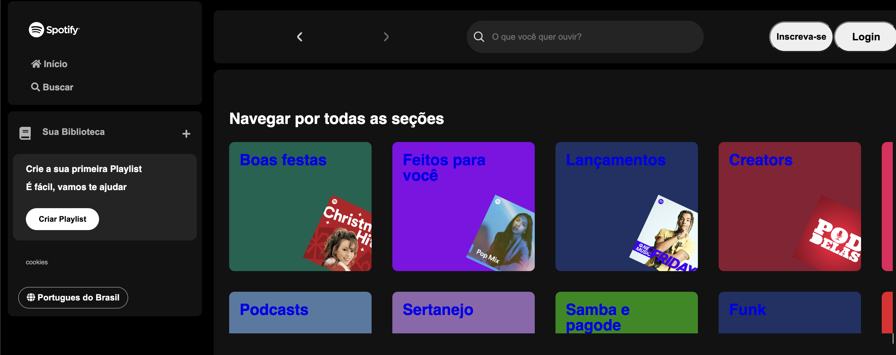

# Spotify Project

> Thales Farias created a site akin to Spotify for practicing HTML and CSS, providing a unique music experience and an opportunity to enhance front-end coding skills

### Adjustments and improvements.

The project is still under development, and the upcoming updates will focus on the following tasks:

- [x] Create a Javascipt file to creat a scearch tool in the website

## 🤝 Creator

<table>
  <tr>
    <td align="center">
      <a href="#" title="Thales Farias">
         
        
          <b>Thales Farias</b>
        
      </a>
    </td>
  </tr>
</table>
